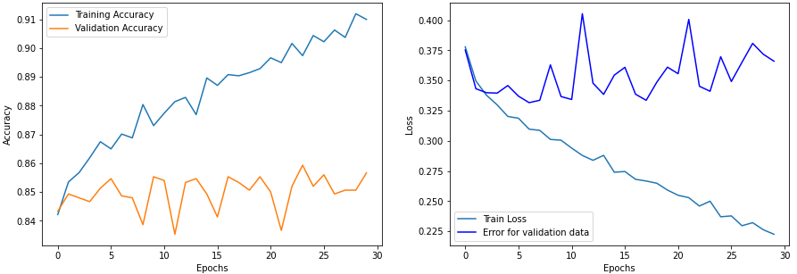
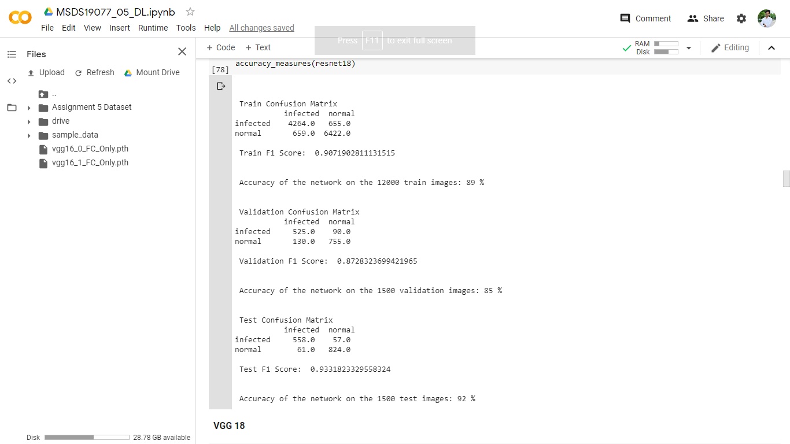

# msds19077_COVID19_DLSpring2020
This repository contains code and results for COVID-19 classification assignment by Deep Learning Spring 2020 course offered at Information Technology University, Lahore, Pakistan. This assignment is only for learning purposes and is not intended to be used for clinical purposes.

# Dataset
Dataset used for this assignment can be found using link blow: 

https://drive.google.com/file/d/1-HQQciKYfwAO3oH7ci6zhg45DduvkpnK/view?usp=sharing

# Task 1: Load pretrained CNN model and fine-tune FC Layers
Our task is to fine-tune Fully Connected layers of ResNet-18 and VGG-16 pretrained models by adding two custom layes and freezed other layer then train model on given dataset. And the results are given blow:
</br></br>
```ResNet-18 Results after find-tune FC Layers:```
</br></br>



</br></br>
```VGG-16 Results after find-tune FC Layers:```
</br></br>
